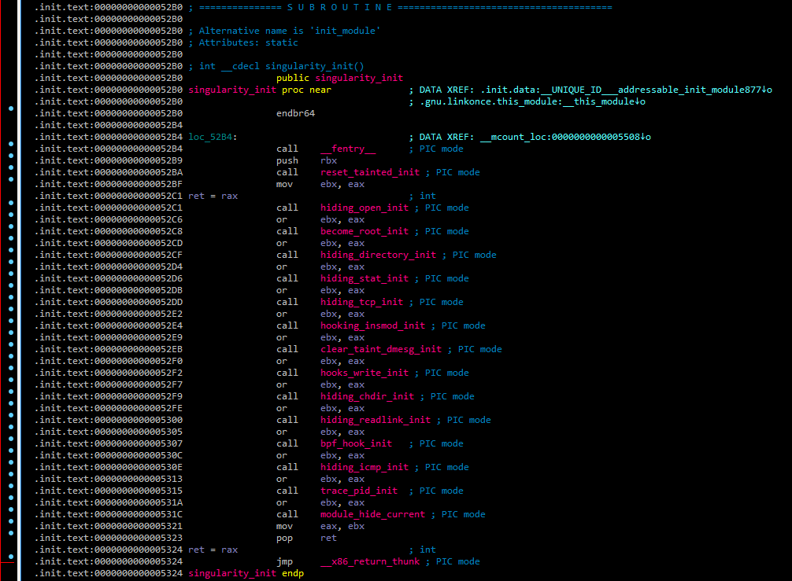

---
Qs1. What is the SHA256 hash of the sample?

**Answer:**

```text
0b8ecdaccf492000f3143fa209481eb9db8c0a29da2b79ff5b7f6e84bb3ac7c8
```

**Artifact:**


---
Qs2. What is the name of the primary initialization function called when the module is loaded?

**Answer:**

```text
init_module
```

**Artifact:**



---
Qs3. How many distinct feature-initialization functions are called within above mentioned function?

**Answer:**

```text
15
```

---
